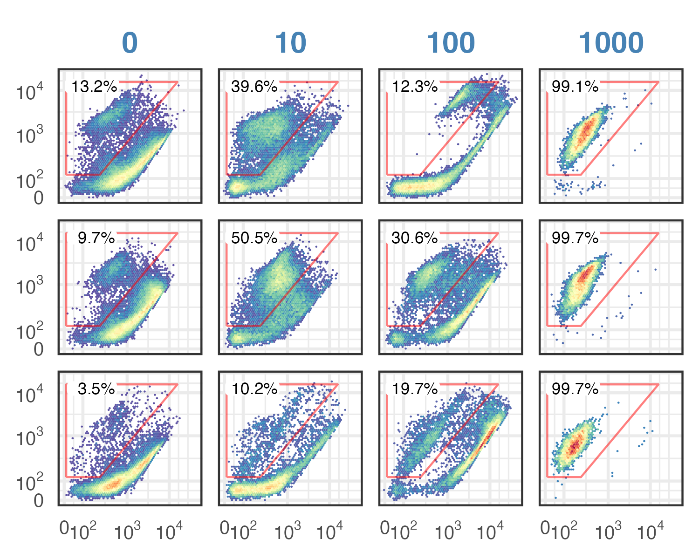

```{r setup, message=FALSE}
require(tidyverse)
require(flowCore)
require(flowClust)
require(openCyto)
require(ggcyto)
require(cowplot)
require(ggrdiges)
```

```{r}
old <- theme_set(theme_minimal())
```

# Background
We previously observed a "dead-like" population in mock-treated samples, and also an unstained population in 10 mM H2O2-treated cells. Here, we explore different staining buffer compositions and monitor those two behaviors.



# Data
This is the flow cytometry data for mig-log phase _C. glabrata_ cells stained with PI/SYTO9/PI+SYTO9 in different staining buffers, and run through flow cytometry (details in ELN).

## Import data
> FCS files are stored in RDSS/user/flow cytometry, FCS is read and write into an input tsv table. The tsv file is avaliable from the Input folder.

```{r}
# use relative path to make it easier for collaboration
data.path = "../../../00-Shared/02-data/02.01-flow-cytometry/20240108-extended-buffer-optimization/"
dat0 <- read.flowSet(path = data.path,
                        transformation = FALSE,        # the original values are already linearized. 
                        emptyValue = FALSE,
                        alter.names = TRUE,            # change parameter names to R format
                        column.pattern = ".H|FSC|SSC") # only load the height variables for the fluorescent parameters
```

Simplify the sample names

```{r}
source("../../../00-Shared/01-script/20220326-simplify-names-subroutine.R")
oriNames <- sampleNames(dat0)
shortNames <- simplifyNames(oriNames); names(shortNames) <- oriNames
tmp <- str_split(oriNames, pattern = "[ _]+", simplify = TRUE)[,c(1, 6, 7, 8)] 
colnames(tmp) <- c("date", "buffer", "treatment", "dye") 
sample <- data.frame(tmp) %>% 
  mutate(
    date = mdy(date),
    dye = factor(dye, levels = c("p.fcs", "s.fcs", "b.fcs"), 
                 labels = c("PI", "SYTO9", "Both")),
      #ifelse(dye == "p.fcs", "PI", ifelse(Dye == "s.fcs", "SYTO9", "Both")),
    buffer = factor(buffer, levels = c("w", "sa", "pb", "sc"),
                    labels = c("ddH2O", "Saline", "PBS", "SD media")),
      #ifelse(Buffer == "sa", "Saline", ifelse(Buffer == "pb", "PBS", ifelse(Buffer == "w", "ddH2O", "sc complete"))),
    treatment = factor(treatment, levels = c(0, 10, 100, 1000))
  )
# define levels vector for plotting
tr.levels = paste(levels(sample$treatment), "mM", sep = " ")
tr.levels[4] = "1M"
names(tr.levels) = levels(sample$treatment)
bu.levels = c("DI Water", "Saline", "PBS", "SD media")
names(bu.levels) = levels(sample$buffer)
# end defining
# assign rownames to the sample data frame, necessary for pData assignment
rownames(sample) <- shortNames
# make a copy of dat0
dat <- dat0
if(all(sampleNames(dat) == oriNames)){
  sampleNames(dat) <- shortNames
}
pData(dat) <- sample
print(pData(dat))
write_tsv(pData(dat), file = "../input/20240916-fig-2-buffer-optimize-sample-info.tsv")
```

# Gatting strategies
> The following gaphing steps are used to gate singlets by FSC and SSC values. Only singlets are included in analysis.

## Gate for singlets
Gate for outlier 

```{r}
outlier.gate <- rectangleGate(filterId = "-outlier", "FSC.H" = c(1.2e5, 1e6), "SSC.H" = c(1e2, 1e6))
ggcyto(dat[13], aes(x = FSC.H, y = SSC.H), subset = "root") +
  geom_hex(bins = 64) + geom_gate(outlier.gate) + facet_wrap(~name, ncol = 2) + ggcyto_par_set(limits = "instrument")
```
Add gate to GS
```{r}
# create a GatingSet
gs <- GatingSet(dat)
# add root gate
gs_pop_add(gs, outlier.gate, parent = "root")
recompute(gs)
```

Gate for singlets

```{r}
scPars <- ggcyto_par_set(limits = list(x = c(0,1e6), y = c(30,300)))
ex <- Subset(dat[c(5, 15)], outlier.gate)
polygon <- matrix(c(1e5, 1e5, 1e6, 1e6, 
                    60, 105, 135,60), ncol = 2)
colnames(polygon) <- c("FSC.H", "FSC.W")
singlet.gate <- polygonGate(filterId = "singlet", .gate = polygon)
ggcyto(ex, aes(x = FSC.H, y = FSC.W)) + geom_hex(bins = 128) + geom_gate(singlet.gate) + geom_stats() + scPars
```


Add this gate to the gatingSet
```{r}
gs_pop_add(gs, singlet.gate, parent = "-outlier", name = "singlet")
recompute(gs)
```

## Gate for the unstained population

> Unstained population is defined as population below 10^2 in both channels (in the noise range).

```{r}
#scPars <- ggcyto_par_set(limits = list(x = c(0,1e6), y = c(0,1e6)))
select <- c(7,19)
ex <- Subset(dat[select], singlet.gate)
polygon2 <- matrix(c(0, 1e2, 1e2, 0,
                    0, 0, 1e2, 1e2), ncol = 2)
colnames(polygon2) <- c("BL1.H", "BL3.H")
unstained.gate <- polygonGate(filterId = "unstained", .gate = polygon2)
ggcyto(ex, aes(x = BL1.H, y = BL3.H)) +
  geom_hex(bins = 64) +
  geom_gate(unstained.gate) + geom_stats() +# scPars +
  scale_x_logicle() + scale_y_logicle() 
```
Add this gate to the gatingSet

```{r eval=FALSE, include=FALSE}
gs_pop_add(gs, unstained.gate, parent = "singlet", name = "unstained")
recompute(gs)
```

## Gate for the dead-like population

> Dead population is defined based on 1M treated sample.

```{r}
#scPars <- ggcyto_par_set(limits = list(x = c(0,1e6), y = c(0,1e6)))
select <- c(19,22)
ex <- Subset(dat[select], singlet.gate)
#polygon <- matrix(c(10^3, 10^2.5,10^3, 10^5,
#                    10^4.5, 10^2.2, 10^2.2, 10^4), ncol = 2)
polygon <- matrix(c(10^2, 10^3, 10^4.5, 10^2.5,
                    10^2.3, 10^2.3, 10^4, 10^4), ncol = 2)
colnames(polygon) <- c("BL1.H", "BL3.H")
dead.gate <- polygonGate(filterId = "dead_like", .gate = polygon)
ggcyto(ex, aes(x = BL1.H, y = BL3.H)) +
  geom_hex(bins = 64) +
  geom_gate(dead.gate) + geom_stats() + #scPars +
  scale_x_logicle() + scale_y_logicle() 
```
Add this gate to the gatingSet

```{r eval=FALSE, include=FALSE}
gs_pop_add(gs, dead.gate, parent = "singlet", name = "dead_like")
recompute(gs)
```


# Analysis & Plots

## Visualize one set of data
With gates
```{r}
subset.to.plot <- with(pData(gs), dye == "Both" & date == '2024-01-09')
p <- ggcyto(gs[subset.to.plot],
            aes(x = BL1.H, y = BL3.H), subset = "singlet") + 
  geom_hex(aes(fill = after_stat(density)), bins = 64) + 
  geom_gate("dead_like", linewidth = 0.5, alpha = 0.5) +
  geom_stats(type = "percent", location = "gate", adjust = c(0, 1),
             digits = 1, size = 3) +
  geom_gate("unstained", linewidth = 0.5, alpha = 0.5) +
  geom_stats(type = "percent", location = "data", adjust = c(0.2, 0.003),
             digits = 1, size = 3) +
  facet_grid(buffer ~ treatment,
             labeller = as_labeller(c(tr.levels, bu.levels), multi_line = F)) +
  scale_x_logicle(breaks = c(10^2, 10^3, 10^4)) + 
  scale_y_logicle(breaks = c(10^2, 10^3, 10^4)) + 
  theme_minimal(base_size = 14) + 
  panel_border(color = "gray20") + #background_grid(major = "none", minor = "none") +
  theme(
    #axis.line = element_blank(),
    strip.text.y = element_text(face = 2),
    strip.text.x = element_text(face = 2),
    axis.text = element_text(size = rel(0.6)),
    plot.title = element_blank(),
    legend.position = "none",
    axis.title = element_blank()
  )
print(p)
ggsave("../output/fig2-compare-staining-buffers-with-gate-20240923.png", width = 5, height = 5)
```
Without gates
```{r}
subset.to.plot <- with(pData(gs), dye == "Both" & date == '2024-01-09')
p <- ggcyto(gs[subset.to.plot],
            aes(x = BL1.H, y = BL3.H), subset = "singlet") + 
  geom_hex(aes(fill = after_stat(density)), bins = 64) + 
  facet_grid(buffer ~ treatment,
             labeller = as_labeller(c(tr.levels, bu.levels), multi_line = F)) +
  scale_x_logicle(breaks = c(10^2, 10^3, 10^4)) + 
  scale_y_logicle(breaks = c(10^2, 10^3, 10^4)) + 
  theme_minimal(base_size = 14) + 
  panel_border(color = "gray20") + #background_grid(major = "none", minor = "none") +
  theme(
    #axis.line = element_blank(),
    strip.text.y = element_text(face = 2),
    strip.text.x = element_text(face = 2),
    axis.text = element_text(size = rel(0.6)),
    plot.title = element_blank(),
    legend.position = "none",
    axis.title = element_blank()
  )
print(p)
ggsave("../output/fig2-compare-staining-buffers-no-gate-20240923.png", width = 5, height = 5)
```
```{r}

```
## Export gated event counts

```{r}
tmp <- gs_pop_get_stats(gs) %>% 
  mutate(pop = gsub(".*/", "", pop), pop = gsub("-outlier", "cells", pop)) %>% 
  pivot_wider(names_from = pop, names_prefix = "n_", values_from = count) %>% 
  mutate(
    pc_dead_like = num(n_dead_like / n_singlet, label = "%", scale = 100),
    pc_unstained = num(n_unstained / n_singlet, label = "%", scale = 100)
  )

gated_stats <- left_join(
  as_tibble(pData(gs)),
  tmp,
  by = c("name" = "sample")
) %>% dplyr::filter(dye == "Both") %>% select(-dye)
  
print(gated_stats)
write_tsv(gated_stats, file = "../output/fig2-compare-staining-buffer-gated-stats.tsv")
```

## Plot percentages
We will primarily look at the mock sample, as the purpose of the buffer comparison is to find a buffer that will minimize the dead-like and unstained populations.
```{r}
p1 <- gated_stats %>% 
  # plot the mock sample only
  dplyr::filter(treatment == "0") %>% 
  pivot_longer(
    cols = starts_with("pc_"),
    names_to = "var",
    values_to = "value"
  ) %>% 
  ggplot(aes(x = buffer, y = value))  + 
  geom_bar(stat = "summary", fun = "mean", fill = "gray80") +
  geom_point(size = 3, position = position_jitter(0.05)) + 
  scale_y_continuous(labels = scales::percent_format()) +
  scale_x_discrete(labels = bu.levels) +
  facet_wrap(~var, nrow = 2, scales = "free_y", labeller = as_labeller(
    c("pc_dead_like" = "% Dead-like", "pc_unstained" = "% Unstained"))) +
  labs(x = NULL, y = "Population frequency") +
  theme_minimal(base_size = 18) + panel_border(color = "gray20") +
  theme(axis.text.x = element_text(angle = 45, hjust = 1),
        strip.text = element_text(color = "steelblue", face = 2))
print(p1 + facet_wrap(~var, ncol = 2, scales = "free_y", labeller = as_labeller(
    c("pc_dead_like" = "% Dead-like", "pc_unstained" = "% Unstained"))))
ggsave(filename = "../output/fig2bc-compare-buffer-plot-stats.png", 
       plot = p1, width = 4, height = 7)
```
## Sample-to-sample variation
Visaulize sample-to-sample variability in mock-treated cells across three replicates
```{r}
subset.to.plot <- with(pData(gs), dye == "Both" & treatment == "0")
date.levels = paste("Replicate", 1:3); names(date.levels) = unique(sample$date)
p <- ggcyto(gs[subset.to.plot],
            aes(x = BL1.H, y = BL3.H), subset = "singlet") + 
  geom_hex(aes(fill = after_stat(density)), bins = 64) + 
  facet_grid(date~buffer, labeller = as_labeller(c(date.levels, bu.levels), 
                                                   multi_line = F)) +
  scale_x_logicle(breaks = c(10^2, 10^3, 10^4)) + 
  scale_y_logicle(breaks = c(10^2, 10^3, 10^4)) + 
  theme_minimal(base_size = 14) + 
  panel_border(color = "gray20") + #background_grid(major = "none", minor = "none") +
  theme(
    #axis.line = element_blank(),
    strip.text.y = element_text(face = 2),
    strip.text.x = element_text(face = 2),
    axis.text = element_text(size = rel(0.6)),
    plot.title = element_blank(),
    legend.position = "none",
    axis.title = element_blank()
  )
print(p)
```

## Supplementary plots
PI-alone
```{r}
subset.to.plot <- with(pData(gs), dye == "PI" & date == '2024-01-09')
p <- ggcyto(gs[subset.to.plot],
            aes(x = BL1.H, y = BL3.H), subset = "singlet") + 
  geom_hex(aes(fill = after_stat(density)), bins = 64) + 
  facet_grid(buffer ~ treatment,
             labeller = as_labeller(c(tr.levels, bu.levels), multi_line = F)) +
  scale_x_logicle(breaks = c(10^2, 10^3, 10^4)) + 
  scale_y_logicle(breaks = c(10^2, 10^3, 10^4)) + 
  theme_minimal(base_size = 14) + 
  panel_border(color = "gray20") + #background_grid(major = "none", minor = "none") +
  theme(
    #axis.line = element_blank(),
    strip.text.y = element_text(face = 2),
    strip.text.x = element_text(face = 2),
    axis.text = element_text(size = rel(0.6)),
    plot.title = element_blank(),
    legend.position = "none",
    axis.title = element_blank()
  )
print(p)
ggsave("../output/fig2sup-compare-staining-buffers-PI-only-20240923.png", width = 5, height = 5)
```
SYTO9 alone
```{r}
subset.to.plot <- with(pData(gs), dye == "SYTO9" & date == '2024-01-09')
p <- ggcyto(gs[subset.to.plot],
            aes(x = BL1.H, y = BL3.H), subset = "singlet") + 
  geom_hex(aes(fill = after_stat(density)), bins = 128) + 
  facet_grid(buffer ~ treatment,
             labeller = as_labeller(c(tr.levels, bu.levels), multi_line = F)) +
  scale_x_logicle(breaks = c(10^2, 10^3, 10^4)) + 
  scale_y_logicle(breaks = c(10^2, 10^3, 10^4)) + 
  theme_minimal(base_size = 14) + 
  panel_border(color = "gray20") + #background_grid(major = "none", minor = "none") +
  theme(
    #axis.line = element_blank(),
    strip.text.y = element_text(face = 2),
    strip.text.x = element_text(face = 2),
    axis.text = element_text(size = rel(0.6)),
    plot.title = element_blank(),
    legend.position = "none",
    axis.title = element_blank()
  )
print(p)
ggsave("../output/fig2sup-compare-staining-buffers-SYTO9-only-20240923.png", width = 5, height = 5)
```


