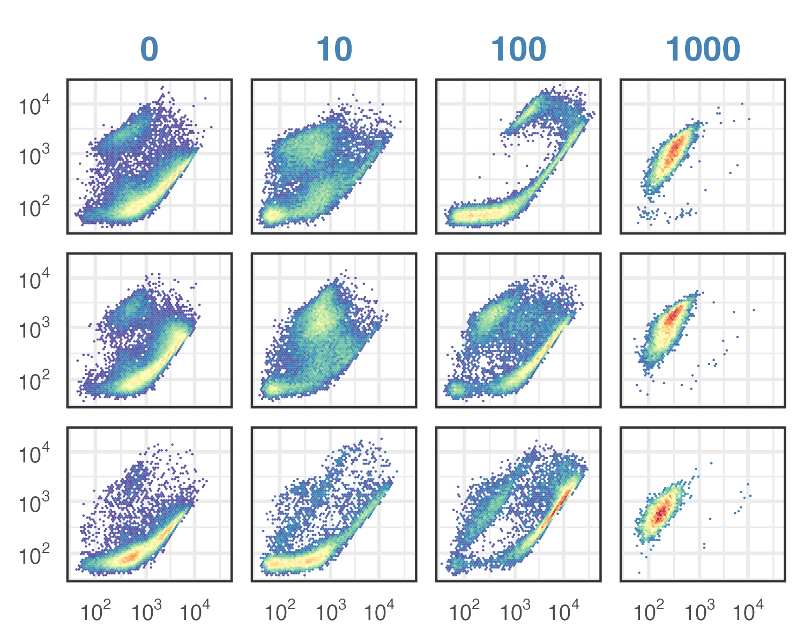

```{r setup, message=FALSE}
require(flowCore)
require(flowClust)
require(openCyto)
require(tidyverse)
require(ggcyto)
require(cowplot)
#require(ggrdiges)
```

```{r}
old <- theme_set(theme_minimal(base_size = 14) + panel_border(color = "gray20"))
```

# Goal
We observed an intermediate high-green high-red population most prominent in the 100 mM treated cells. This is different from what's shown in the FungaLight manual. We hypothesize that the high-green high-red popuplation are damaged cells that are more permeable to SYTO9 but not yet permeable to PI. We test this hypothesis by quantifying SYTO9 and PI staining signals in samples treated with increasing concentrations of hydrogen peroxide. To distinguish the signals in the red channel between SYTO9 and PI, we apply the two dyes separately.


**Note the high green high red population in the 100 mM H2O2 treated _C. glabrata_ cells **

# Import data
> original FCS files are stored in RDSS/user/hanxi-tang/flow cytometry. FCS files are copied to the current directory

```{r}
# use relative path to make it easier for collaboration
data.path = paste0("../input/202311", 20:22, " Dilutions+0-1000mM/")
# read all files into a list of three flowSets
tmp <- map(data.path, \(x)
           read.flowSet(
             # the original values are already linearized. 
             path = x, transformation = FALSE,
             # only include FCS files
             pattern = "\\.fcs$",
             # change parameter names to R format
             emptyValue = FALSE,  alter.names = TRUE,
             # only load the height variables for the fluorescent parameters
             column.pattern = ".H|FSC|SSC")
)
dat0 <- rbind2(tmp[[1]], tmp[[2]]) |> rbind2(tmp[[3]])
```

Simplify the sample names
```{r}
oriNames <- sampleNames(dat0)
tmp <- str_split(oriNames, pattern = "[ _]+", simplify = TRUE)[,c(1, 5, 6, 7)] 
colnames(tmp) <- c("Date", "Treatment", "Dilution", "Dye") 
sample <- data.frame(tmp) %>% 
  mutate(
    Date = mdy(Date),
    Dye = ifelse(Dye == "p.fcs", "PI", "SYTO9"),
    Dilution = as.numeric(gsub(".fcs", "", Dilution)),
    Treatment = factor(Treatment, levels = c(0, 10, 100, 1000))
  )
rownames(sample) <- oriNames
dat <- dat0
pData(dat) = sample
write_tsv(sample, file = "../input/20231222-SYTO9-PI-permeability-sample-info.tsv")
```

Set up factor levels
```{r}
dilution.levels = paste(c(250, 500, 1000, 2000), "x", sep = "")
names(dilution.levels) = c(250, 500, 1000, 2000)
treat.levels = paste(c(0, 10, 100), "mM", sep = " ") |> c("1M")
names(treat.levels) = c(0, 10, 100, 1000)
```

# Gating strategies
## Gating for singlets
>The following gaphing steps are used to gate singlets by FSC and SSC values. Only singlets are included in analysis.

>Gate for outlier 

```{r}
outlier.gate <- rectangleGate(filterId = "-outlier", "FSC.H" = c(1.2e5, 1e6), "SSC.H" = c(1e2, 1e6))
ggcyto(dat[c(2,24)], aes(x = FSC.H, y = SSC.H), subset = "root") +
  geom_hex(bins = 64) + geom_gate(outlier.gate) + facet_wrap(~name, ncol = 2) +
  ggcyto_par_set(limits = "instrument")
```
Add gate to GS
```{r}
gs <- GatingSet(dat) # create a GatingSet
gs_pop_add(gs, outlier.gate, parent = "root")
recompute(gs)
```

>Gate for singlets

```{r}
scPars <- ggcyto_par_set(limits = list(x = c(0,1e6), y = c(30,300)))
ex <- Subset(dat[c(1,11)], outlier.gate)
polygon <- matrix(c(1e5, 1e5, 1e6, 1e6, 
                    60, 105, 135,60), ncol = 2)
colnames(polygon) <- c("FSC.H", "FSC.W")
singlet.gate <- polygonGate(filterId = "singlet", .gate = polygon)
ggcyto(ex, aes(x = FSC.H, y = FSC.W)) +
  geom_hex(bins = 128) +
  geom_gate(singlet.gate) + geom_stats() + 
  scPars + panel_border(color = "gray20")
```


Add this gate to the gatingSet
```{r}
gs_pop_add(gs, singlet.gate, parent = "-outlier", name = "singlet")
recompute(gs)
```
## Gate for PI-positive cells

```{r}
scPars <- ggcyto_par_set(limits = list(x = c(0,1e6), y = c(0,1e6)))
ex <- Subset(dat[c(5, 17)], singlet.gate)
polygon <- matrix(c(0, 10^2.5, 10^2.5, 0, 
                    10^2.2, 10^2.2, 10^5, 10^5), ncol = 2)
colnames(polygon) <- c("BL1.H", "BL3.H")
PI.gate <- polygonGate(filterId = "PI-positive", boundaries = polygon)
ggcyto(ex, aes(x = BL1.H, y = BL3.H)) + geom_hex(bins = 128) + geom_gate(dead.gate) + geom_stats() + scPars + scale_x_logicle() + scale_y_logicle() 
```
Add this gate to the gatingSet

```{r eval=FALSE, include=FALSE}
gs_pop_add(gs, dead.gate, parent = "singlet", name = "PI-positive")
recompute(gs)
```

## Gate for SYTO9 high-green and high-red population

```{r}
scPars <- ggcyto_par_set(limits = list(x = c(0,1e6), y = c(0,1e5)))
ex <- Subset(dat[c(2, 24)], singlet.gate)
polygon <- matrix(c(10^2.7, 10^6, 10^6,   # BL1.H green
                    10^2.2, 10^2.2, 10^5),# BL3.H red
                  ncol = 2)
#polygon <- matrix(c(1e2, 1e6, 1e6, 1e2,
#                    10^2, 10^2, 1e6, 1e6), ncol = 2)
colnames(polygon) <- c("BL1.H", "BL3.H")
SYTO9.gate <- polygonGate(filterId = "Intermediate", .gate = polygon)
ggcyto(ex, aes(x = BL1.H, y = BL3.H)) + 
  geom_hex(bins = 128) + 
  geom_gate(SYTO9.gate) + geom_stats() + scPars + 
  scale_x_logicle() + scale_y_logicle() 
```
Add this gate to the gatingSet

```{r eval=FALSE, include=FALSE}
gs_pop_add(gs, SYTO9.gate, parent = "singlet", name = "Intermediate")
recompute(gs)
```

## Gate for live population

```{r}
#scPars <- ggcyto_par_set(limits = list(x = c(0,1e6), y = c(0,1e6)))
ex <- Subset(dat[c(9,12)], singlet.gate)
polygon <- matrix(c(0, 10^5, 10^5, 0,     # BL1.H, green
                    10^2.2, 10^2.2, 0, 0),# BL3.H, red
                  ncol = 2)
colnames(polygon) <- c("BL1.H", "BL3.H")
live.gate <- polygonGate(filterId = "live", boundaries = polygon)
ggcyto(ex, aes(x = BL1.H, y = BL3.H)) + 
  geom_hex(bins = 128) + 
  geom_gate(live.gate) + geom_stats() + scPars + 
  scale_x_logicle() + scale_y_logicle() 
```

Add this gate to the gatingSet

```{r eval=FALSE, include=FALSE}
gs_pop_add(gs, live.gate, parent = "singlet", name = "live")
recompute(gs)
```

## Extract population statistics 
Export the counts and MFI separately
```{r}
# we are only interested in the populations after singlet gating
nodes <- c("singlet", "PI-positive", "Intermediate", "live")
# get the event count
gated_cnt <- gs_pop_get_stats(gs, nodes, type = "count")
# get the MFI for each parameter in each population of interest
gated_mfi <- gs_pop_get_stats(gs, nodes, type = pop.MFI) %>% 
  select(sample, pop, starts_with("FungaLight"))
```

combine the two datasets
```{r}
gated_stats <- full_join(gated_cnt, gated_mfi, by = c("sample", "pop")) %>% 
  right_join(pData(gs), by = c("sample" = "name")) %>% 
  relocate(Date, Treatment, Dye, Dilution, .after = sample) %>% 
  relocate(sample, .after = last_col())
write_tsv(gated_stats, file = "../input/20240430-Cg-SYTO9-gated-stats.tsv")
```

# Plotting and testing

## Overview, one replicate
```{r}
# set some thematic elements
p.common <- list(
  scale_x_logicle(breaks = 10^c(2,3,4,5)),
  scale_y_logicle(breaks = 10^c(2,3,4,5)),
  labs(title = NULL, x = NULL, y = NULL)
)
# PI positive
select <- with(pData(gs), 
               Date == "2023-11-20" &  Dilution == "1000" & Dye == "PI")
p1 <- ggcyto(gs[select], subset = "singlet",
            aes(x = BL1.H, y = BL3.H)) + 
  geom_hex(bins = 128) + 
  geom_gate(PI.gate) + 
  geom_stats(digits = 1, adjust = c(0.8, 0.3)) +
  facet_wrap(~Treatment, nrow = 1) +
  p.common +
  theme(strip.text = element_blank()) + scPars

# SYTO9 intermediate
select <- with(pData(gs), 
               Date == "2023-11-20" &  Dilution == "1000" & Dye == "SYTO9")
p2 <- ggcyto(gs[select], subset = "singlet",
            aes(x = BL1.H, y = BL3.H)) + 
  geom_hex(bins = 128) + 
  geom_gate(SYTO9.gate) +
  geom_stats(digits = 2, adjust = c(0.2, 0.2)) +
  facet_wrap(~Treatment, nrow = 1) +
  p.common + 
  theme(strip.text = element_blank()) + scPars
plot_grid(as.ggplot(p2), as.ggplot(p1), nrow = 2, align = "h")
ggsave("../output/20250105-fig3a-PI-pos-intermediate-pop.png",
       width = 6, height = 3.5)
```

## Stats, all replicates
Here we will be presenting the percentages of the PI-positive and Intermediate populations from all three replicates.

Plot the percentages
```{r}
# prepare data
tmp <- gated_stats %>% 
  dplyr::filter(Dilution == "1000") %>% 
  group_by(Date, Treatment, Dye) %>% 
  mutate(perc = count / count[pop == "singlet"],
         .after = count) %>% 
  # the following filtering function retains only the relevant subpopulation
  # count > 2 remove rows with the mismatching population and dye, e.g., 
  # PI-positive and SYTO9
  dplyr::filter(pop %in% c("PI-positive", "Intermediate"), count > 2) %>% 
  mutate(Treatment = fct_inorder(Treatment),
         Dye = factor(Dye, levels = c("SYTO9", "PI")))

p <- tmp %>% 
  ggplot(aes(x = Treatment, y = perc)) +
  #geom_bar(stat = "summary", fun = "mean", fill = "gray60", width = 0.6) +
  stat_summary(fun = "mean", geom = "point", shape = 95, color = "red",
               size = 10) +
  geom_point(position = position_jitter(0.1), size = 1) +
  facet_wrap(~Dye,
             labeller = labeller(Dye = c("SYTO9" = 'SYTO9\n"Intermediate"', 
                                         "PI" = "PI-positive"))) +
  scale_y_continuous(name = "Percentage", limits = c(0, 1.05),
                     labels = scales::percent) +
  xlab(bquote(H[2]*O[2]~(mM)))
p
ggsave("../output/20250106-fig3b-percent-PI-pos-SYTO9-inter-over-treat.png",
       width = 3.8, height = 2.8)
```
Statistical test (ANOVA)
1. For SYTO9
```{r}
lm <- lm(perc ~ Treatment, data = dplyr::filter(tmp, Dye == "SYTO9"))
summary(lm)
```

2. For PI
```{r}
lm <- lm(perc ~ Treatment, data = dplyr::filter(tmp, Dye == "PI"))
summary(lm)
```

## MFI for all cells
MFI will be plotted for all events in order to reveal an overall increase in SYTO9 signal in contrast to PI
```{r}
# prepare data
tmp <- gated_stats %>% 
  dplyr::filter(Dilution == "1000", pop == "singlet", Dye == "SYTO9") %>% 
  rename(Green = "Fungalight Green-H", Red = "Fungalight Red-H") %>% 
  mutate(Treatment = fct_inorder(Treatment)) %>% 
  dplyr::select(Date, Treatment, Green, Red) %>% 
  pivot_longer(Green:Red, names_to = "Channel", values_to = "MFI")

p <- tmp %>% 
  ggplot(aes(x = Treatment, y = MFI)) +
  stat_summary(fun = "mean", geom = "point", color = "red",
               shape = 95, size = 10) +
  #stat_summary(aes(group = 1), fun = "mean", geom = "line", linetype = 2,
  #             linewidth = 0.7, color = "gray50") +
  geom_point(position = position_jitter(0.1), size = 1) +
  facet_wrap(~Channel, scale = "free_y",
             labeller = labeller(Channel =
                                   c("Green" = 'SYTO9-Green\n(all events)', 
                                             "Red" = "SYTO9-Red\n(all events)"))) +
  xlab(bquote(H[2]*O[2]~(mM))) + #ylab("Fluorescence") +
  scale_y_continuous("MFI (x100, a.u.)",
                     labels = scales::label_number(scale = 1e-2))# +
  #theme(strip.text.x = element_text(margin = margin(0.4,0,0.4,0, "cm")))
p
ggsave("../output/20250106-fig3c-MFI-SYTO9-inter-over-treat.png",
       width = 3.8, height = 2.8)
```
Statistical test (ANOVA)
1. For SYTO9
```{r}
lm <- lm(MFI ~ Treatment, data = dplyr::filter(tmp, Channel == "Green"))
summary(lm)
```

2. For PI
```{r}
lm <- lm(MFI ~ Treatment, data = dplyr::filter(tmp, Channel == "Red"))
summary(lm)
```

---

Below are Hanxi's analysis code. They are commented out and saved as an archive for future reference.

<!---
```{r}
sub <- dat.f1[pData(dat.f1)$Dye == "PI" & pData(dat.f1)$Date == "112023"] 
sg <- Subset(sub, singlet.gate)
p2 <- sg %>% 
  ggcyto(aes(x = "BL1.H", y = "BL3.H")) + 
  geom_hex(bins = 80, aes(fill = ..ncount..)) + geom_gate(dead.gate) + geom_stats(adjust = c(19, 0.1)) +
  facet_grid(Dilution ~ Treatment, 
             labeller = as_labeller(c("0 mM" = "0 mM", "10 mM" = "10 mM", "100 mM" = "100 mM", "1000 mM" = "1000 mM", 
                                      "250 x" = "250x", "500 x" = "500x", "1000 x" = "1000x", "2000 x" = "2000x"))) + 
  theme_minimal()
p2 + scale_x_logicle(breaks = c(100, 1000, 10000)) + scale_y_logicle(breaks = c(100, 1000, 10000)) +
  xlab("FungaLight Green Fluorescence") + ylab("FungaLight Red Fluorescence")  +
  panel_border(color = "black", size = 2) +
  theme(axis.line = element_blank(),
        strip.background = element_blank(),
        axis.text.x = element_text(size = 25, face = "bold", color = "black"),  # Adjust size and face (bold)
        axis.text.y = element_text(size = 25, face = "bold", color = "black"),
        axis.title.x = element_text(size = 25, face = "bold"),
        axis.title.y = element_text(size = 20, face = "bold")
        )+ 
  theme(strip.text = element_text(size = 20, face = "bold")) 
#ggsave("/space/htang5/Documents/FUN1_data_analysis/biol-4386-course-project-htang5/Methods Paper Writing/01-SYTO9-Midlog-Characterization/output/20240425-PI-Dilutions-Raw-Flow-Plot.png")
```
```{r fig.width=16, fig.height=4}
sub <- dat.f1[pData(dat.f1)$Dye == "PI" & pData(dat.f1)$Date == "112023" & pData(dat.f1)$Dilution == "1000 x"] 
sg <- Subset(sub, singlet.gate)
scPars <- ggcyto_par_set(limits = list(x = c(0,1e6), y = c(0,1e6)))
p2 <- sg %>% 
  ggcyto(aes(x = "BL1.H", y = "BL3.H")) + 
  geom_hex(bins = 80, aes(fill = ..ncount..)) + geom_gate(dead.gate, size = 1) + geom_stats(adjust = c(20, 0.1), size = 10) +
  facet_grid(Dilution ~ Treatment, 
             labeller = as_labeller(c("0 mM" = "0 mM", "10 mM" = "10 mM", "100 mM" = "100 mM", "1000 mM" = "1000 mM", 
                                      "250 x" = "250x", "500 x" = "500x", "1000 x" = "1000x", "2000 x" = "2000x"))) + 
  theme_minimal()
p2 + scale_x_logicle (breaks = c(100, 1000, 10000, 100000, 1000000)) + scale_y_logicle (breaks = c(100, 1000, 10000, 100000, 1000000)) +
  coord_cartesian(xlim = c(1, 1e6), ylim = c(1, 1e6)) +
  xlab("FungaLight Green Fluorescence") + ylab("FungaLight Red Fluorescence")  +
  panel_border(color = "black", size = 2) +
  theme(axis.line = element_blank(),
        strip.background = element_blank(),
        axis.text.x = element_text(size = 25, face = "bold", color = "black"),  # Adjust size and face (bold)
        axis.text.y = element_text(size = 25, face = "bold", color = "black"),
        axis.title.x = element_text(size = 25, face = "bold"),
        axis.title.y = element_text(size = 20, face = "bold")
        )+ 
  theme(strip.text = element_text(size = 20, face = "bold")) 
ggsave("/space/htang5/Documents/FUN1_data_analysis/biol-4386-course-project-htang5/Methods Paper Writing/01-SYTO9-Midlog-Characterization/output/20240521-PI-1000x-Raw-Flow-Plot.png")
```

```{r fig.width=16, fig.height=4}
sub <- dat.f1[pData(dat.f1)$Dye == "SYTO9" & pData(dat.f1)$Date == "112023" & pData(dat.f1)$Dilution == "1000 x"] 
sg <- Subset(sub, singlet.gate)
scPars <- ggcyto_par_set(limits = list(x = c(0,1e6), y = c(0,1e6)))
p2 <- sg %>% 
  ggcyto(aes(x = "BL1.H", y = "BL3.H")) + 
  geom_hex(bins = 80, aes(fill = ..ncount..)) + geom_gate(RP.gate, size = 1) + geom_stats(adjust = c(0.05, 0.1), size = 10) +
  facet_grid(Dilution ~ Treatment, 
             labeller = as_labeller(c("0 mM" = "0 mM", "10 mM" = "10 mM", "100 mM" = "100 mM", "1000 mM" = "1000 mM", 
                                      "250 x" = "250x", "500 x" = "500x", "1000 x" = "1000x", "2000 x" = "2000x"))) + 
  theme_minimal()
p2 + scale_x_logicle (breaks = c(100, 1000, 10000, 100000, 1000000)) + scale_y_logicle (breaks = c(100, 1000, 10000, 100000, 1000000)) +
  coord_cartesian(xlim = c(1, 1e6), ylim = c(1, 1e6)) +
  xlab("FungaLight Green Fluorescence") + ylab("FungaLight Red Fluorescence")  +
  panel_border(color = "black", size = 2) +
  theme(axis.line = element_blank(),
        strip.background = element_blank(),
        axis.text.x = element_text(size = 25, face = "bold", color = "black"),  # Adjust size and face (bold)
        axis.text.y = element_text(size = 25, face = "bold", color = "black"),
        axis.title.x = element_text(size = 25, face = "bold"),
        axis.title.y = element_text(size = 20, face = "bold")
        )+ 
  theme(strip.text = element_text(size = 20, face = "bold")) 
ggsave("/space/htang5/Documents/FUN1_data_analysis/biol-4386-course-project-htang5/Methods Paper Writing/01-SYTO9-Midlog-Characterization/output/20240521-SYTO9-1000x-Raw-Flow-Plot.png")
```

> PI quantifications

```{r}
gated_data %>% 
   dplyr::filter(Dye == "PI") %>% 
 mutate(Dilution = gsub("(\\d+) x", "\\1x", Dilution)) %>% 
  mutate(Dilution = factor(Dilution, levels = c("250x", "500x", "1000x", "2000x"))) %>% 
ggplot(aes(x = Dilution, y = percent_Dead)) +
  geom_point(size = 3, position = position_jitter(0.1)) + 
  scale_color_brewer(palette = "Dark2") +
  stat_summary(fun.data = "mean_cl_boot", geom = "pointrange", color = "red2",
               size = 0.8, position = position_nudge(x = 0.3)) +
  facet_wrap(~ Treatment, nrow = 1, scales = "free_x") +
  scale_y_continuous(labels = scales::percent) +
  xlab("PI Folds Dilution") + ylab("% Red Positive Gated")  +
    theme_minimal() +
  theme(strip.text = element_text(size = rel(1), face = 3))+
  panel_border(color = "black", size = 1.5) +
  theme(axis.line = element_blank(),
        strip.background = element_blank(),
        axis.text.x = element_text(size = 20, face = "bold", color = "black", angle = 90),  # Adjust size and face (bold)
        axis.text.y = element_text(size = 20, face = "bold", color = "black"),
        axis.title.x = element_text(size = 20, face = "bold"),
        axis.title.y = element_text(size = 20, face = "bold")
        )+ theme(strip.text = element_text(size = 18, face = "bold")) 
ggsave("/space/htang5/Documents/FUN1_data_analysis/biol-4386-course-project-htang5/Methods Paper Writing/01-SYTO9-Midlog-Characterization/output/20240409-PI-Dilutions-Gated-Percentage-Plot.png", width = 10, height = 7)
```


```{r}
sub <- dat.f1[pData(dat.f1)$Dye == "SYTO9" & pData(dat.f1)$Date == "112023"]
sg <- Subset(sub, singlet.gate)
p2 <- sg %>% 
  ggcyto(aes(x = "BL1.H", y = "BL3.H")) + 
  geom_hex(bins = 80, aes(fill = ..ncount..)) + geom_gate(RP1.gate) + geom_stats(adjust = c(0.01, 0.1)) +
  facet_grid(Dilution ~ Treatment, 
             labeller = as_labeller(c("0 mM" = "0 mM", "10 mM" = "10 mM", "100 mM" = "100 mM", "1000 mM" = "1000 mM", 
                                      "250 x" = "250x", "500 x" = "500x", "1000 x" = "1000x", "2000 x" = "2000x"))) + 
  theme_minimal()
p2 + scale_x_logicle() + scale_y_logicle() +
  coord_cartesian(xlim = c(1, 1e6), ylim = c(1, 1e6)) +
  xlab("FungaLight Green Fluorescence") + ylab("FungaLight Red Fluorescence") +
  panel_border(color = "black", size = 1) +
  theme(axis.line = element_blank(),
        strip.background = element_blank(),
        axis.text.x = element_text(size = 10, color = "black"),  # Adjust size and face (bold)
        axis.text.y = element_text(size = 10, color = "black"),
        axis.title.x = element_text(size = 16, face = "bold"),
        axis.title.y = element_text(size = 16, face = "bold")
        ) + 
  theme(strip.text = element_text(size = 12, face = "bold")) 
ggsave("/space/htang5/Documents/FUN1_data_analysis/biol-4386-course-project-htang5/Methods Paper Writing/01-SYTO9-Midlog-Characterization/output/20240409-SYTO9-Dilutions-Raw-Flow-Plot.png", width = 7, height = 5)
```

# Extract MFI across flowFrames
>MFI are extracted and wrote into tsv. The tsv is stored in the input folder.

```{r}
tmp <- fsApply(dat.f1, each_col, median)
if(all(rownames(tmp) == rownames(sample))){
  combined_data_f1 <- cbind(pData(dat.f1), tmp) %>% 
    as.tibble() %>% relocate(name, .after = last_col())
}
#write_tsv(combined_data_f1, file = "../Input/20231228-fig-1-MFI-ht.tsv")
print(combined_data_f1)
```

# Graph Green MFIs against teatment and group by dye concentration
>Several output graphs are produced. The graphs are include in Figure 1 Panel A.

```{r}
combined_data_f1 %>%
  dplyr::filter(Treatment == "0 mM") %>%
   mutate(Label = paste(Dilution, Dye, sep = "_"),
         Signal = ifelse(Dye == "PI", BL3.H, BL1.H)) %>%
  mutate(Dilution = gsub("(\\d+) x", "\\1x", Dilution)) %>% 
  mutate(Dilution = factor(Dilution, levels = c("250x", "500x", "1000x", "2000x"))) %>% 
  ggplot(aes(x = Dilution, y = Signal, group = Dye, color = Dye))  + 
  geom_bar(aes(fill = Dye), stat = "summary", fun = "mean", position = position_dodge(), alpha = 0.7) +
  theme_minimal()  +
  xlab("Dye Folds Dilution") + ylab("Fluorescent Signal")  +
    theme_minimal() +
  panel_border(color = "black", size = 1.5) +
   theme(axis.line = element_blank(),
        strip.background = element_blank(),
        axis.text.x = element_text(size = 20, face = "bold", color = "black"),  # Adjust size and face (bold)
        axis.text.y = element_text(size = 20, face = "bold", color = "black"),
        axis.title.x = element_text(size = 20, face = "bold"),
        axis.title.y = element_text(size = 20, face = "bold"),
        legend.title = element_text(size = 18, face = "bold"),
        legend.text = element_text(size = 18, face = "bold"),  # Set legend text size and face
        strip.text = element_text(size = 18, face = "bold")  # Adjust size and face for strip text
  ) 
ggsave("/space/htang5/Documents/FUN1_data_analysis/biol-4386-course-project-htang5/Methods Paper Writing/01-SYTO9-Midlog-Characterization/output/20240411-SYTO9-vsPI-Plot.png")

```

```{r}
pf1a <- combined_data_f1 %>%
  dplyr::filter(Dye == "SYTO9") %>% 
  dplyr::filter(Dilution == "1000 x") %>%
  mutate(Treatment = gsub("1000 mM", "1 M", Treatment)) %>%
  mutate(Treatment = factor(Treatment, levels = c("0 mM", "10 mM", "100 mM", "1 M"))) %>%
  ggplot(aes(x = Treatment, y = BL1.H)) +
  geom_point(stroke = 1, size = 2, position = position_jitter(0.2)) +
  stat_summary(fun.data = "mean_cl_boot", geom = "pointrange", color = "red2",
               size = 0.8, position = position_nudge(x = 0.1)) +
  theme_minimal()
pf1a + labs(x = bquote(H[2]*O[2]), y = "Green MFI") +
  panel_border(color = "black", size = 1.5) +
  theme(axis.line = element_blank(),
        strip.background = element_blank(),
        axis.text.x = element_text(size = 25, face = "bold", color = "black"),  # Adjust size and face (bold)
        axis.text.y = element_text(size = 25, face = "bold", color = "black"),
        axis.title.x = element_text(size = 25, face = "bold"),
        axis.title.y = element_text(size = 25, face = "bold")
        )
ggsave("../output/20240522-SYTO9-Dilutions-Green-MFI-Plot.png", width = 7, height = 5)
```

> Graph red MFI for various SYTO9 dilutions


```{r}
pf1a <- combined_data_f1 %>%
  dplyr::filter(Dye == "SYTO9") %>% 
  dplyr::filter(Dilution == "1000 x") %>%
  mutate(Treatment = gsub("1000 mM", "1 M", Treatment)) %>%
  mutate(Treatment = factor(Treatment, levels = c("0 mM", "10 mM", "100 mM", "1 M"))) %>%
  ggplot(aes(x = Treatment, y = BL3.H)) +
  geom_point(stroke = 1, size = 2, position = position_jitter(0.2)) +
  stat_summary(fun.data = "mean_cl_boot", geom = "pointrange", color = "red2",
               size = 0.8, position = position_nudge(x = 0.1)) +
  theme_minimal()
pf1a +
 labs(x = bquote(H[2]*O[2]), y = "Red MFI") +
  panel_border(color = "black", size = 1.5) +
  theme(axis.line = element_blank(),
        strip.background = element_blank(),
        axis.text.x = element_text(size = 25, face = "bold", color = "black"),  # Adjust size and face (bold)
        axis.text.y = element_text(size = 25, face = "bold", color = "black"),
        axis.title.x = element_text(size = 25, face = "bold"),
        axis.title.y = element_text(size = 25, face = "bold")
        )
ggsave("../output/20240522-SYTO9-Dilutions-Red-MFI-Plot.png", width = 7, height = 5)
```

> Graph a scatter plot for median red and greens for each population
No output from this plotting.

```{r}
combined_data_f1 %>%
  dplyr::filter(Dye == "SYTO9") %>% 
  dplyr::filter(Treatment == "0 mM") %>%
  ggplot(aes(x = BL1.H, y = BL3.H)) +
  geom_point(aes(color = interaction(Dye, Dilution))) +
  facet_wrap(~Treatment)
  #stat_summary(fun.data = "mean_cl_boot", geom = "line", size = 0.2, position = position_nudge(x = 0.1), aes(group = interaction(Dye, Dilution), color = interaction(Dye, Dilution))) +
  labs(x = "Hydrogen Peroxide Treatment", y = "Median Red Fluorescence") +
  panel_border(color = "black", size = 1.5) +
  theme(axis.line = element_blank(),
        #axis.title.x = element_blank(), 
        strip.background = element_blank(),
        axis.text.x = element_text(size = 16, face = "bold"),  # Adjust size and face (bold)
        axis.text.y = element_text(size = 16, face = "bold"),
        axis.title.x = element_text(size = 16, face = "bold"),
        axis.title.y = element_text(size = 16, face = "bold")
        )
```

```{r}
p1 <- gated_data %>% 
  dplyr::filter(Dye == "SYTO9") %>% 
  dplyr::filter(Dilution == "1000 x") %>% 
   dplyr::filter(!(Treatment %in% c("0 mM")))  %>%
  mutate(Treatment = gsub(" mM", "", Treatment)) %>%
  ggplot(aes(x = Treatment, y = percent_Live))  + 
  geom_bar(stat = "summary", fun = "mean", fill = "skyblue2", alpha = 0.7) +
  geom_point(size = 3, position = position_jitter(0.2)) + 
   scale_y_continuous(labels = scales::percent_format()) +
  labs(x = bquote(H[2]*O[2]~(mM)), y = "% Live Population") +
  ggtitle("SYTO9 only") +  
  theme(plot.title = element_text(hjust = 30)) +
  theme_cowplot(font_size = 16) 

p2 <- gated_data %>% 
  dplyr::filter(Dye == "SYTO9") %>% 
  dplyr::filter(Dilution == "1000 x") %>% 
   dplyr::filter(!(Treatment %in% c("0 mM")))  %>%
  ggplot(aes(x = Treatment, y = percent_Live))  + 
  geom_bar(stat = "summary", fun = "mean", fill = "skyblue2", alpha = 0.7) +
  geom_point(size = 3, position = position_jitter(0.2)) + 
   scale_y_continuous(labels = scales::percent_format()) +
  labs(x = bquote(H[2]*O[2]~(mM)), y = "% Red Negative") +
  ggtitle("SYTO9 only") +  
  theme(plot.title = element_text(hjust = 30)) +
  theme_cowplot(font_size = 16) 

p3 <- gated_data %>% 
  dplyr::filter(Dye == "SYTO9") %>% 
  dplyr::filter(Dilution == "1000 x") %>% 
   dplyr::filter(!(Treatment %in% c("0 mM")))  %>%
  ggplot(aes(x = Treatment, y = percent_Live))  + 
  geom_bar(stat = "summary", fun = "mean", fill = "skyblue2", alpha = 0.7) +
  geom_point(size = 3, position = position_jitter(0.2)) + 
   scale_y_continuous(labels = scales::percent_format()) +
  labs(x = bquote(H[2]*O[2]~(mM)), y = "% Red Negative") +
  ggtitle("SYTO9 only") +  
  theme(plot.title = element_text(hjust = 30)) +
  theme_cowplot(font_size = 16) 
  
combined_plot <- plot_grid(p1, p2, p3, nrow = 1, ncol = 3, common.legend = TRUE, align = 'hv', widths = c(6, 6, 6))
print(combined_plot)
ggsave("../output/20240430-SYTO9-Cg-Log-Gated.png")
```
--->